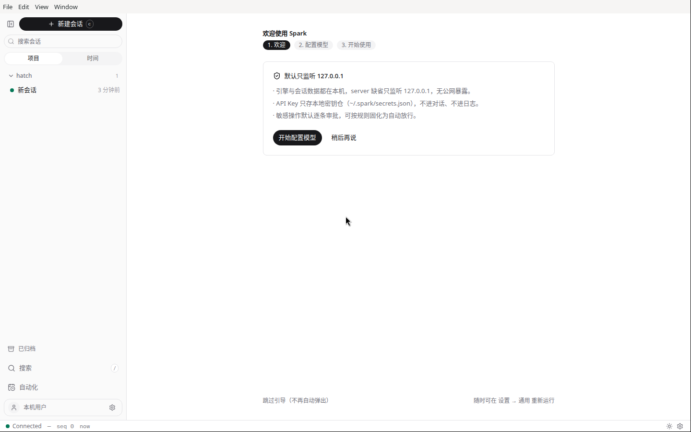
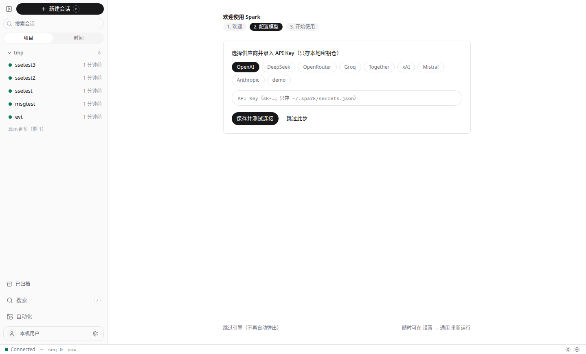
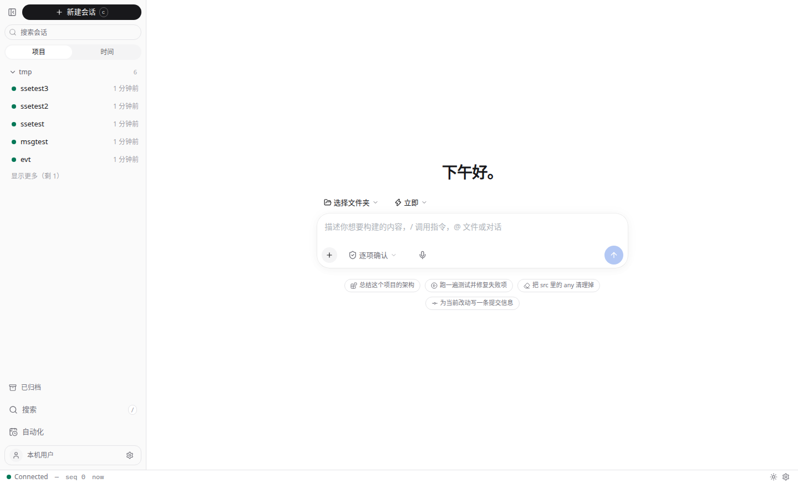
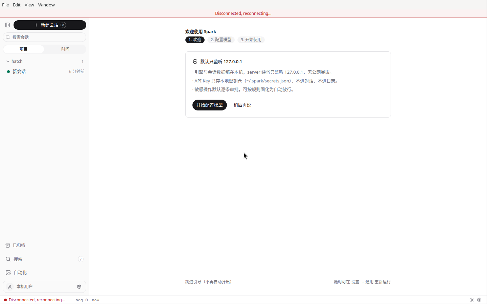
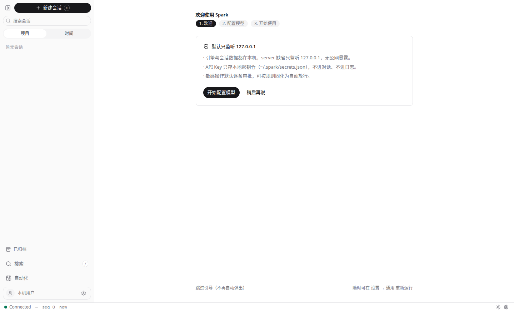
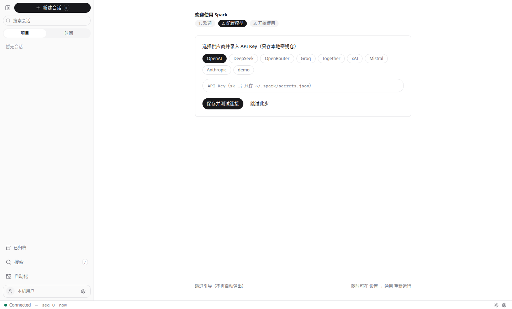
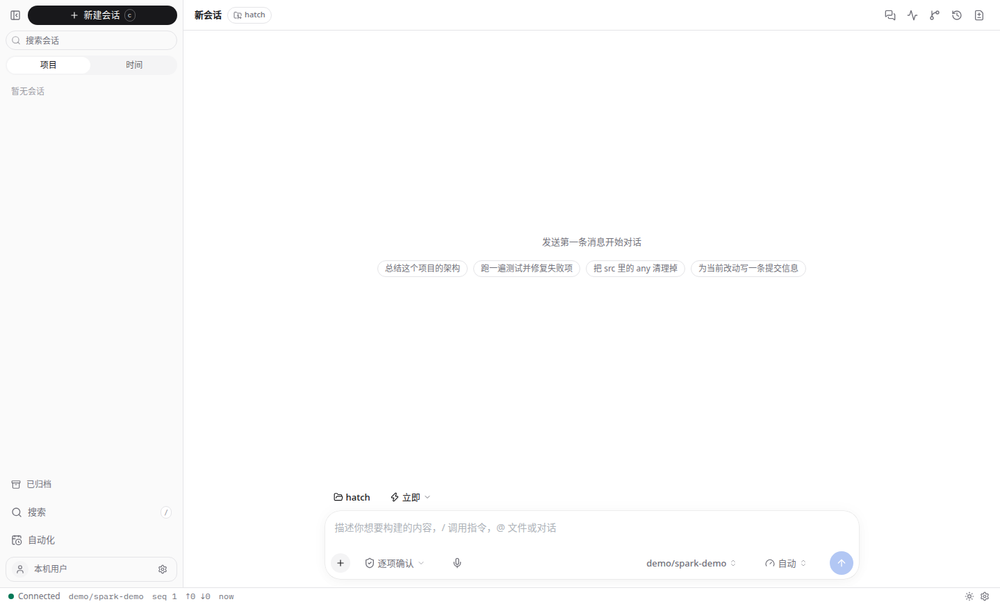
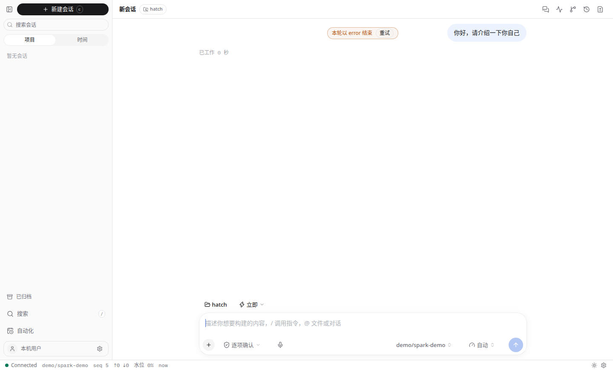

# Spark 真机手工测试报告（2026-10-01）

| 版本 | 日期 | 测试人 | 说明 |
| ---- | ---- | ------ | ---- |
| v1.0 | 2026-10-01 | 小白（AI） | web / desktop / cli 三端真机走查；mobile 无设备未测 |

> 口径：按 `doc/06-testing-plan.md` §5「四端手工走查清单模板」（正常 / 审批 / 中断 / 断线重连 四幕 × 四端）执行并记录。

## 1. 测试环境

- 机器：Linux x86_64 虚拟机（root），Node v24.20.0，pnpm 9.15.9
- 仓库：`Wanfeng1028/Spark` @ `e36b433`（main）
- 构建：`pnpm install`（node_modules ~1.4G）；`pnpm --filter @spark/desktop build` 成功（web prod 构建 + server sidecar bundle + Electron main tsc，仅 Vite 大 chunk 警告）
- Electron 44.0.0（经 `node install.js` 下载官方二进制）
- 运行方式：
  - server：`tsx apps/server/src/index.ts` → `http://127.0.0.1:4318`
  - web：`vite --port 5173`（代理到 4318）
  - desktop：`electron apps/desktop --no-sandbox`（Xvfb :99，1440×900；sidecar 随机端口）
  - cli：`tsx apps/cli/src/main.tsx`
- 模型配置：演示用 `models.json`（demo provider，`baseUrl=http://127.0.0.1:9`，无真实 API Key）。**依赖真实模型的流式回复 / 工具调用 / 审批 / 中断三幕本次无法验证**，以"模型调用失败"错误路径的优雅降级代替；配真实 Key 后需重测。

## 2. 测试矩阵（四幕 × 四端）

| 幕 | 步骤 | web | desktop | cli | mobile |
| -- | ---- | --- | ------- | --- | ------ |
| 一 正常 | 建会话→发消息→流式回复→工具调用展开→完成 | ⚠️ 建会话✅ / 发消息✅ / 流式回复未验证（无真实模型；错误态 ✅ 优雅） | ⚠️ 同左 | ⚠️ `spark -p` headless 跑通，turn 以 error 闭合 | 未测（无设备） |
| 二 审批 | bash 审批→挂起→允许/总是允许/拒绝 | 未测（需真实模型触发工具调用） | 未测 | 未测 | 未测 |
| 三 中断 | 流式中断 turn→状态回 idle | 未测 | 未测 | 未测 | 未测 |
| 四 断线 | 杀 server→断线条→重启→自动重连 | ✅ | —（sidecar 随壳同生死，无独立断线态） | — | 未测 |

## 3. web 端

### 3.1 启动与欢迎流程 ✅

dev 服务器 + 后端均就绪后访问 `http://127.0.0.1:5173/`，首启欢迎页三步走（1.欢迎 / 2.配置模型 / 3.开始使用）正常渲染，安全提示"默认只监听 127.0.0.1"展示，状态栏 `Connected`。

### 3.2 模型配置页 ✅

点击"开始配置模型"进入第 2 步：供应商九宫格（OpenAI / DeepSeek / OpenRouter / Groq / Together / xAI / Mistral / Anthropic / demo）、API Key 输入框（提示只存 `~/.spark/secrets.json`）、"保存并测试连接"/"跳过此步"。

### 3.3 主界面 ✅

跳过引导后进入主界面："下午好。"问候、composer（"描述你想要构建的内容，/ 调用指令，@ 文件或对话"）、快捷建议 chips（总结架构 / 跑测试修失败项 / 清理 any / 写提交信息）、会话列表（API 测试产生的会话正常落库展示）、状态栏 `Connected`。

### 3.4 断线重连 ✅（幕四）

kill 掉 4318 server 约 10 秒后，顶部出现红色横幅 `Disconnected, reconnecting...`，状态栏同步变红。重启 server 后约 20 秒自动恢复 `Connected`，红条消失，无需刷新页面。

## 4. desktop 端

### 4.1 启动与 sidecar ✅

`electron . --no-sandbox`（root 需 `--no-sandbox`）拉起，主进程在随机端口 spawn sidecar（`ELECTRON_RUN_AS_NODE=1` 跑 server bundle），探活 `/api/healthz` 通过后建主窗口。主窗口完整渲染：侧边栏（新建会话 / 搜索 / 项目-时间 / 已归档 / 自动化 / 本机用户）、状态栏 `Connected — seq 0 now`。

### 4.2 首启向导 ✅

无 `models.json` 时先弹配置引导窗（AUD-12，不再静默秒退），文案含最小配置示例与密钥安全提示；`models.json` 出现后自动关闭引导窗、拉 sidecar、建主窗（LA-43 续启序列）。

### 4.3 新建会话 ✅

点击"新建会话"：会话视图正常打开（workspace `hatch`、模型 `demo/spark-demo`、模式"自动"、建议 chips），状态栏 `seq 1`，该会话随后在 web 端会话列表中可见（同一 `SPARK_HOME` 数据目录）。

### 4.4 发送消息（错误路径）✅

在 composer 输入"你好，请介绍一下你自己"并发送：turn 以 error 闭合，界面显示 `本轮以 error 结束` + `重试` 按钮，用户消息保留，composer 完好可继续输入，状态栏保持 `Connected`——无真实模型时的降级表现符合预期。

## 5. cli 端

- `--help` ✅：命令一览（TUI / `up` / `migrate` / `mcp` / `-p` headless）与键位表输出正常。
- `spark -p "<prompt>"`（headless）✅：进程内跑完一轮退出，`--output-format json` 返回 5 事件闭环 `session.created → user.message → turn.started → error → turn.completed`，exit 0；text 格式输出 `（无文本输出）`。
- `spark mcp`（stdio MCP server）✅：`initialize` 握手成功，`tools/list` 返回 `spark_run` 等工具。
- TUI ✅：PTY 下渲染正常（`[now] >` 输入框、状态栏、帮助行）。

## 6. API 探活（server :4318）

| 接口 | 结果 |
| ---- | ---- |
| `GET /api/healthz` | ✅ 200（注意：`/api/health` 是 404，见 §7 P3） |
| `GET /api/sessions` | ✅ 200，会话列表 |
| `POST /api/sessions` | ✅ 创建成功，返回 `id/title/model/cwd/createdAt/lastSeq/status` |
| `GET /api/sessions/:id` | ✅ 200，含 `events` 数组 |
| `POST /api/sessions/:id/messages` | ✅ `{"result":"started","turnId":"trn_..."}`（异步 turn） |
| `GET /api/event?sessionId=&since=`（SSE） | ✅ 完整事件序列：`session.created → user.message → turn.started → error → turn.completed(finish=error) → checkpoint.created` |
| `GET /api/sessions/不存在` | ✅ 404 `{"code":"E_NOT_FOUND","message":"not found"}` |

## 7. 发现的问题

### P1：桌面端不认 `SPARK_HOME`（配置目录 split-brain）

- `apps/desktop/src/main.ts:180/181/457` 三处写死 `join(homedir(), '.spark')`（首启向导配置目录、日志提示、fatal 窗），未走引擎 `sparkHome()`。
- sidecar 经 `buildSidecarEnv({ baseEnv: process.env, ... })` 正确继承 `SPARK_HOME`，引擎侧读的是 `$SPARK_HOME`。
- 用户可见后果：首启向导指引用户去改 `~/.spark/models.json`，但引擎实际读 `$SPARK_HOME/models.json`——**按向导操作配完模型也白配**（本次复现：`SPARK_HOME=/tmp/spark-home` 启动，向导仍显示并打开 `/home/hatch/.spark`）。
- 建议：main.ts 改用 `sparkHome()`（引擎 `home.ts` 已有，且注释明确警告过"改一处漏三处"的漂移——桌面端正是漏掉的那一处）。

### P2（观察项）：会话 checkpoint 把整个 cwd 做 git 化，体积失控

- 测试中 `/tmp/spark-home/sessions` 膨胀到 **484M**：checkpoint 目录下的 `.git/objects` 含 home 目录全量（含 `node_modules`）。
- 会话 cwd 缺省为用户 home 时，checkpoint ≈ 备份整个 home（含其他项目的 `.git`、依赖目录）。
- 建议：checkpoint 增加 ignore 规则（`node_modules` / `.git` / 大二进制），或收紧 cwd 缺省作用域。

### P3（小）：`/api/health` 不存在

- 健康检查是 `/api/healthz`；`/api/health` 返回 404。若文档/脚本写的是 `health` 会误导，建议统一或在文档注明。

## 8. 结论

- web / desktop / cli 三端在演示模型配置下**均可完整启动**，核心链路（建会话→发消息→错误闭合、断线重连、SSE 事件流、MCP）工作正常，UI 渲染与交互符合预期。
- 真实模型相关的流式回复 / 审批 / 中断三幕，需配置真实 API Key 后重测（届时 2.1/2.2/3.x 可补为 ✅/❌）。
- 本次发现：1 个 P1（`SPARK_HOME` split-brain，建议建工单）、1 个观察项（checkpoint 体积）、1 个小问题（health 路径）。
- 测试产生的会话与 checkpoint 数据均为演示数据，未污染仓库；报告截图 10 张已入库 `doc/walkthrough-assets/manual-20261001/`。
