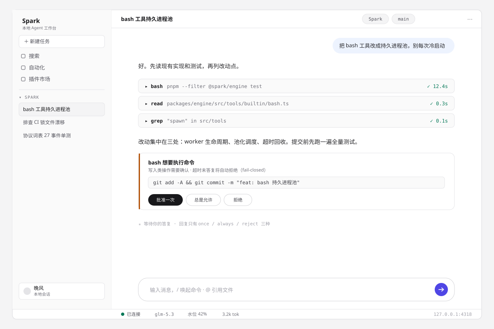
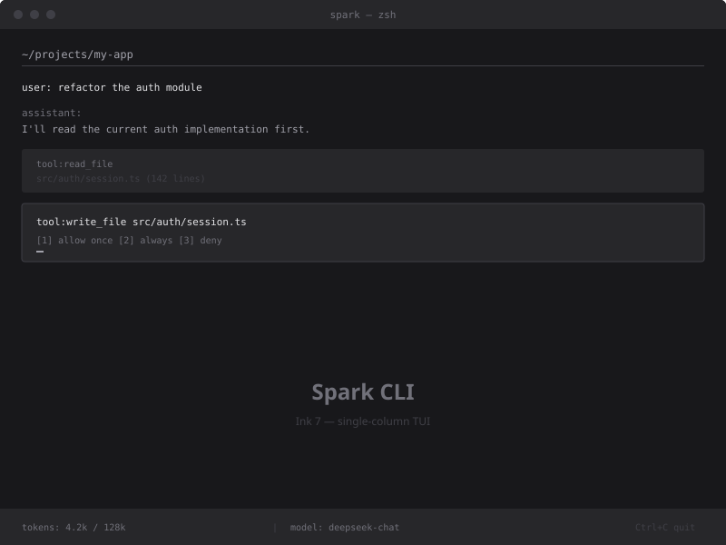
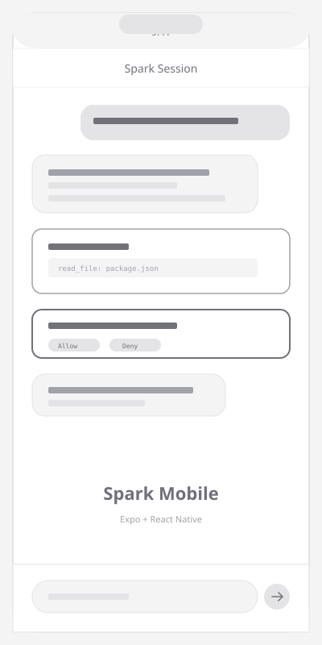
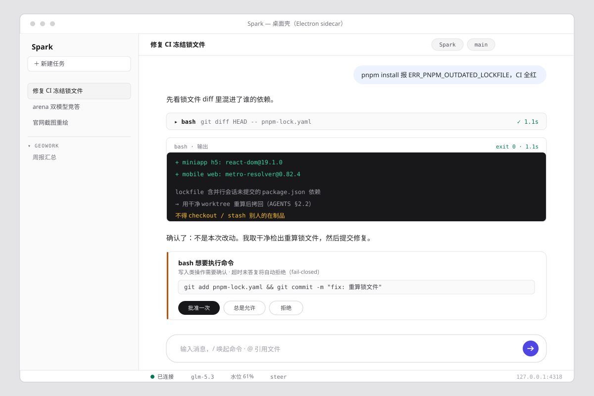

<div align="center">


# Spark

**Agent 工作台**

引擎 headless · UI 是事件流的投影 · 四端同一协议

[](../LICENSE)
[](https://nodejs.org)
[](https://typescriptlang.org)
[](https://pnpm.io)

[文档](../doc/) · [快速上手](#快速上手) · [CHANGELOG](../CHANGELOG.md) · [贡献指南](../CONTRIBUTING.md)

</div>

---

## 产品预览

<table>
<tr>
<td align="center"><br><sub>Web — 流式对话与工具调用可视化</sub></td>
<td align="center"><br><sub>CLI — Ink 7 单栏 TUI</sub></td>
</tr>
<tr>
<td align="center"><br><sub>移动端 — Expo + React Native</sub></td>
<td align="center"><br><sub>桌面端 — Electron sidecar</sub></td>
</tr>
</table>

## 核心能力

**流式对话** — token 级 delta 增量渲染，27 种事件类型经 SSE 单端点实时推送到客户端。

**工具调用可视化** — 每次工具执行在会话流中呈现为可折叠块，内含 diff 预览与终端输出；23 条内置命令覆盖文件读写、bash 执行、搜索、浏览器操作。

**人工审批（fail-closed）** — 写类工具触发审批卡，内联在调用位置；超时、异常、中断一律拒绝而非放行。四档权限：允许一次 / 本项目总是 / 该用户总是 / 拒绝。

**四端同一协议** — Web / Desktop / CLI / Mobile 共享 `@spark/protocol`（zod schema + Transport 接口），durable 事件 append-only 落盘 `~/.spark/sessions/`，可回放、可分叉、可回滚。

## 架构一览

```
apps/web            React 19 SPA — 只消费事件流（applyEvent reducer）
   │  HttpTransport：REST 命令 + GET /api/event（SSE 单端点，since=seq 断线续播）
   ▼
packages/protocol   前后端唯一合同：27 种事件词表 · zod schema · Transport 接口
   ▼
apps/server         Fastify 薄壳：REST + SSE + 静态托管（127.0.0.1，无鉴权）
   ▼
packages/engine     InputQueue(now/steer/queue) → RunLoop → ToolPipeline
                    PermissionService（挂起/级联）· SessionManager（JSONL 树）· LlmGateway
   ▼
~/.spark/sessions/<cwd>/<ses_id>.jsonl    durable 事件日志（append-only，可回放）
```

## 快速上手

```bash
# 1. 安装 CLI
npm i -g @spark/cli

# 2. 拉起 server + 进入 TUI（退出连带回收 server）
spark up

# 3. 配模型（首回合前一次性）
#    编辑 ~/.spark/models.json 声明 OpenAI 兼容供应商
#    API key 经环境变量注入（不落盘、不入日志）
export DEEPSEEK_API_KEY=sk-xxx
```

发第一条消息后，写类工具会弹审批卡：`1` 允许一次 / `2` 本项目总是 / `3` 该用户总是 / `4` 拒绝。

## 技术栈

| 层   | 技术                                                                                           |
| ---- | ---------------------------------------------------------------------------------------------- |
| 前端 | Vite 7 · React 19 · TypeScript(strict) · Tailwind CSS v4 · shadcn/ui · streamdown · zustand     |
| 后端 | Node 24+ · Fastify · SSE · `@earendil-works/pi-ai` · append-only JSONL 会话日志              |
| CLI  | Ink 7 · `@spark/protocol` 四端共享（transport / applyEvent / 错误文案 / 键位表）               |
| 移动 | Expo + React Native · Taro 4 微信小程序                                                        |
| 桌面 | Electron sidecar 壳（NSIS 安装包经 GH Actions 构建）                                           |
| 布局 | pnpm monorepo：`packages/protocol` · `packages/engine` · `packages/sdk` · `apps/*`             |

## 安全模型

- **默认绑定 127.0.0.1** — 非环回绑定强制开启配对鉴权（6 位码换长效 token）
- **审批 fail-closed** — 超时、异常、中断一律拒绝；bash 工具默认全审批
- **硬边界先行** — 路径越界在审批之前直接拒绝；密钥只从环境变量与本机密钥仓读取
- **每一步可审计** — durable 事件 append-only 落盘，日志与审计流统一脱敏

## 项目结构

```
spark/
├── packages/
│   ├── protocol/        # 唯一合同：事件词表 · zod schema · Transport 接口
│   ├── engine/          # headless 引擎：RunLoop · ToolPipeline · SessionManager
│   └── sdk/             # L2 客户端装配层（HTTP + inprocess 双入口）
├── apps/
│   ├── web/             # React 19 SPA
│   ├── desktop/         # Electron 壳
│   ├── server/          # Fastify 薄壳
│   ├── cli/             # Ink 7 TUI
│   ├── mobile/          # Expo + RN
│   └── miniapp/         # Taro 4 小程序
├── official/            # 产品官网（独立于 workspace）
├── doc/                 # 设计文档 · 调研 · 开发方案 · 审计
└── examples/            # SDK 示例 · eval 场景集
```

## 文档导航

| 文档 | 内容 |
| ---- | ---- |
| [CHANGELOG.md](../CHANGELOG.md) | 用户可见变更（Keep a Changelog） |
| [CONTRIBUTING.md](../CONTRIBUTING.md) | 环境要求 · 工单认领 · PR 自查 · 发版纪律 |
| [AGENTS.md](../AGENTS.md) | AI 代理工作规范（硬性约定 + 规则放置） |
| [ARCHITECTURE.md](../ARCHITECTURE.md) | 架构总览 · ADR · 代码黑名单 |
| [DESIGN.md](../DESIGN.md) | 视觉与交互规则 · token/密度 · 组件 DoD |
| [doc/02](../doc/02-development-plan.md) | 完整开发方案：协议/引擎/前端/服务端规格 + 工单表 |
| [doc/08](../doc/08-v2-roadmap.md) | v2 展望与工单库（阶段十一~十六） |

## 贡献

阅读 [CONTRIBUTING.md](../CONTRIBUTING.md) 查看环境要求与提交流程。

开发命令：

```bash
pnpm install
pnpm --filter server dev    # 后端（tsx watch，缺省 127.0.0.1:4318）
pnpm --filter web dev       # 前端（VITE_SPARK_MOCK=1 可脱离后端跑 Mock）
pnpm --filter cli dev       # CLI TUI（需 server 在跑）
pnpm test                   # vitest
pnpm typecheck              # tsc --noEmit
```

全部验证由 CI 执行，本地不跑（AGENTS §2.2 本机零验证约束）。

## 许可

MIT © 2026 [Wanfeng1028](https://github.com/Wanfeng1028)
